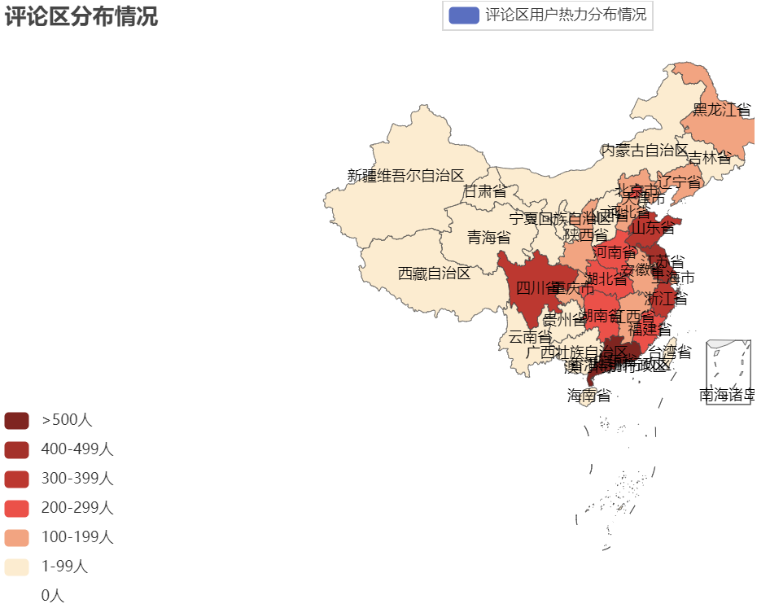

## 数据科学与工程导论期末实验报告
# 网易云歌手银临歌曲特征与评论用户画像分析
## 一、选题分析  
### （一）项目任务、项目目的  
随着互联网的发展，古风类歌曲逐渐走入人们的视野。但因为其发展时间有限，至今仍旧算得上较为冷门小众的分类之一。谈到古风歌曲，就不得不提及这个小众圈子里最具特色的人物————银临，她用其独特宛若银铃般的歌喉、惊艳众人的创作天赋为我们带来众多动听的歌曲。为使其能够在互联网普及的背景下能够发展得越来越好，本次实验将通过对银临歌曲评论区信息及用户信息进行分析，构建用户画像，提取歌曲特征，为其未来的发展提供参考意见。
### （二）研究意义、重要性  
在互联网普及的背景下，如何利用大数据来指导发展值得我们思考。通过对评论区用户信息进行分析，探究如何逐渐吸引粉丝圈层之外的用户，如何在既定特色之外进行更多创新，以迎合大众品味，吸引更多的粉丝是我们本次研究的重点，希望本次实验能够给歌手未来的创作倾向提供一些指导意义。
## 二、数据收集
首先对歌手的全部歌曲进行信息统计，找出最受欢迎的歌曲。
### （一）遇到的障碍
**1.动态加载页面爬虫**。网易云音乐**采取动态加载技术**，使用传统的request进行爬取很容易发现，得到的信息是不完整的，其中没有我们想要的东西。在这个过程中，我走了很多弯路，包括模拟浏览器写入headers进行发送请求，也包括使用fiddler进行app抓包，但是都失败了，即使这样得到的信息也是不完整的，因此在这里怀疑网易云可能使用了某些防止爬虫的技术对爬虫进行拦截。

**解决方法**：在进行大量的查阅资料后，发现能够**调用网易云的api**进行数据调用，因此选择将网易云api部署在vercel之后，进行访问来获得信息。  
**2.爬取歌曲评论区**。在考虑使用网易云api后仍然发现要获取歌曲评论区全部内容比较困难，经过试验，发现只能获取评论区前1024条评论，剩下的内容变成了乱码。通过获取数目的特殊性可以猜测，网易云在该处也采用了一定的限制。
### （二）获得数据
本次数据采集主要分为以下两个部分：  
1.**歌手全部专辑中歌曲信息**（歌名、链接、id号）  
  
2.**歌手十首歌曲评论区全部用户信息**（昵称、id号、年龄、性别、所在城市、省份、个人介绍、评论内容、评论点赞数、评论时间），共计8236条评论数据

## 三、数据处理
### 数据清洗  
对数据中的缺失值与问题值进行处理  
**1.缺失值处理**  
去除重复值，将缺失文本用空字符串填充  

  
**2.数据变换**  
将praise列类型转换为int，将时间转换为时间戳以便处理
  
## 四、数据探索  
首先对数据进行简单观测，发现user_introduce列有缺失值，用空字符串替换  
  
### （一）数据简单观测  
**1.数字型数据特征值**  
  
接下来将探究这三列数据的具体分布  
**2.提取时间戳**  
方便后面针对不同年、不同月、不同天、不同时的评论进行分析和预测  
  
### （二）Matplotlib统计图绘制  
**1.探究性别**  
发现评论区用户女性明显多于男性  
  
**2.探究年龄**
用户年龄大多集中在20岁  
  
**3.探究高赞评论内容**  
获取获赞最多的评论内容，发现评论区用户很喜欢结合自身经历  
  
**4.探究地区分布**  
利用映射表，统计评论区用户全国分布情况，发现评论区用户主要分布在广东、江浙一代  
  
## 五、特征工程及相关性分析
**1.观测数据相关性**  
将年龄不为0，性别非1/2的行提取出来fl_df作为我们探究相关性的原始数据  
**对数据进行特征提取，计算相关系数**

**绘制热力图**  
  
得到用户年龄与性别相关联程度较大，更近一步探究：  
**绘制年龄与性别对比图**
  
发现男性年长者在评论区留言较多，女性30岁以下在评论区留言较多

**2.相关性图表**  
1.探究年龄与获赞数量：  
  
可以发现评论区用户年龄在20岁左右评论获赞数较多  
2.探究月份对应评论数统计  
  
发现在12月份及8月份评论数量较多  
3.探究不同性别获赞数  
  
发现评论区女性用户获赞数较男性多  
## 六、数据建模  
在本节将对文本型数据进行探究，进行主题提取以及情感分析
### （一）词云
### （二）主题分析
### （三）snownlp模型的用户评论情感分析
### （四）情感分析预测

## 七、总结