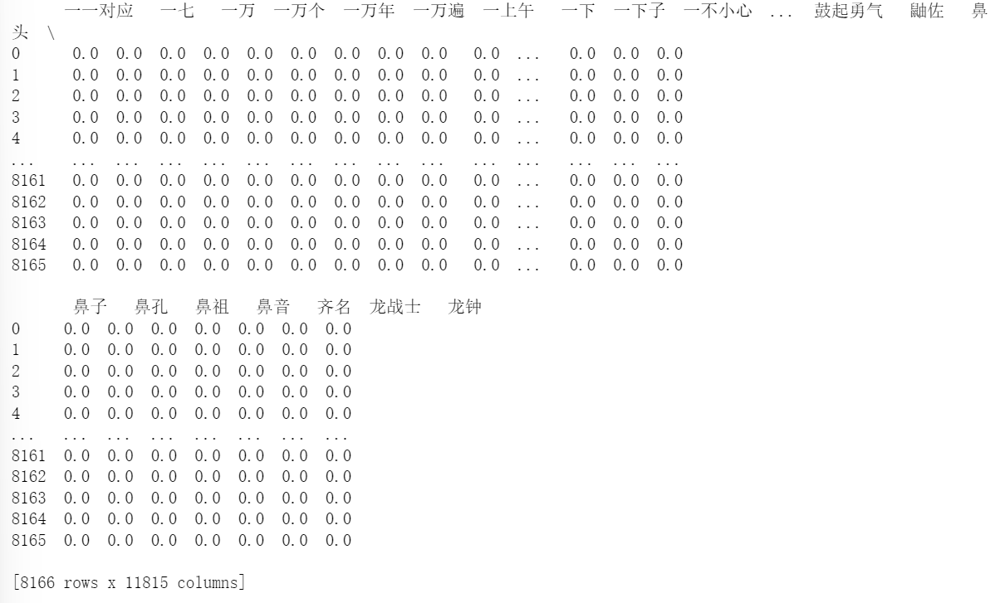

## 数据科学与工程导论期末实验报告
**附件介绍：  
歌曲相关数据————歌曲爬取之后原始数据  
代码过程数据————代码执行过程中得到的数据  
代码————爬取数据、执行数据科学过程的代码  
大屏展示————由dataease制作的大屏图像**  
# 网易云歌手银临歌曲特征与评论用户画像分析
## 一、选题分析  
### （一）项目任务、项目目的  
随着互联网的发展，古风类歌曲逐渐走入人们的视野。但因为其发展时间有限，至今仍旧算得上较为冷门小众的分类之一。谈到古风歌曲，就不得不提及这个小众圈子里最具特色的人物————银临，她用其独特宛若银铃般的歌喉、惊艳众人的创作天赋为我们带来众多动听的歌曲。为使其能够在互联网普及的背景下能够发展得越来越好，本次实验将通过对银临歌曲评论区信息及用户信息进行分析，构建用户画像，提取歌曲特征，为其未来的发展提供参考意见。
### （二）研究意义、重要性  
在互联网普及的背景下，如何利用大数据来指导发展值得我们思考。通过对评论区用户信息进行分析，探究如何逐渐吸引粉丝圈层之外的用户，如何在既定特色之外进行更多创新，以迎合大众品味，吸引更多的粉丝是我们本次研究的重点，希望本次实验能够给歌手未来的创作倾向提供一些指导意义。
## 二、数据收集
**注：为方便数据收集与图形可视化，本次实验采用pychram与notebook两个软件进行**  
首先对歌手的全部歌曲进行信息统计，找出最受欢迎的歌曲。
### （一）遇到的障碍
**1.动态加载页面爬虫**。网易云音乐**采取动态加载技术**，使用传统的request进行爬取很容易发现，得到的信息是不完整的，其中没有我们想要的东西。在这个过程中，我走了很多弯路，包括**模拟浏览器写入headers进行发送请求**，也包括**使用fiddler进行app抓包**，但是都失败了，即使这样得到的信息也是不完整的，因此在这里怀疑网易云可能使用了某些防止爬虫的技术对爬虫进行拦截。

**解决方法**：在进行大量的查阅资料后，发现能够**调用网易云的api**进行数据调用，因此选择将网易云api部署在vercel之后，进行访问，获得json文件来获得信息。  
**2.爬取歌曲评论区**。在考虑使用网易云api后仍然发现要获取歌曲评论区全部内容比较困难，经过试验，发现只能获取评论区前1024条评论，剩下的内容变成了乱码。通过获取数目的特殊性可以猜测，网易云在该处也采用了一定的限制。
### （二）获得数据
本次数据采集主要分为以下两个部分：  
1.**歌手全部专辑中歌曲信息**（歌名、链接、id号）（见文件music_song.csv）  
  
2.**歌手十首歌曲评论区全部用户信息**（昵称、id号、年龄、性别、所在城市、省份、个人介绍、评论内容、评论点赞数、评论时间），共计8236条评论数据（见文件total.csv）

## 三、数据处理
见文件（total_已处理.csv）
### 数据清洗  
对数据中的缺失值与问题值进行处理  
**1.缺失值处理**  
去除重复值，将缺失文本用空字符串填充  

  
**2.数据变换**  
将praise列类型转换为int，将时间转换为时间戳以便处理
  
## 四、数据探索  
见文件（total_已探索.csv）  
首先对数据进行简单观测，发现user_introduce列有缺失值，用空字符串替换  
  
### （一）数据简单观测  
**1.数字型数据特征值**  
  
接下来将探究这三列数据的具体分布  
**2.提取时间戳**  
方便后面针对不同年、不同月、不同天、不同时的评论进行分析和预测  
  
### （二）Matplotlib统计图绘制  
**1.探究性别**  
发现评论区用户女性明显多于男性  
  
**2.探究年龄**
用户年龄大多集中在20岁  
  
**3.探究高赞评论内容**  
获取获赞最多的评论内容，发现评论区用户很喜欢结合自身经历  
  
**4.探究地区分布**  
利用映射表，统计评论区用户全国分布情况，发现评论区用户主要分布在广东、江浙一代  
  
（见文件 "评论区用户热力分布图-Copy1.html"）
## 五、特征工程及相关性分析
**1.观测数据相关性**  
将年龄不为0，性别非1/2的行提取出来fl_df作为我们探究相关性的原始数据  
**对数据进行特征提取，计算相关系数**

**绘制热力图**  
  
得到用户年龄与性别相关联程度较大，更近一步探究：  
**绘制年龄与性别对比图**
  
发现男性年长者在评论区留言较多，女性30岁以下在评论区留言较多

**2.相关性图表**  
1.探究年龄与获赞数量：  
  
可以发现评论区用户年龄在20岁左右评论获赞数较多  
2.探究月份对应评论数统计  
  
发现在12月份及8月份评论数量较多  
3.探究不同性别获赞数  
  
发现评论区女性用户获赞数较男性多  
## 六、数据建模  
在本节将对文本型数据进行探究，进行主题提取以及情感分析  
**注：模型的选取依赖于数据，由于数据为评论区数据，没有具体划分情感倾向，因此使用无监督学习模型进行建模，本实验在此可以改进为如何通过有监督学习模型进行建模**
### （一）词云  
通过对十首歌的歌词进行提取，制作出词云，从词云中可以看出，歌词偏向于美好的事物，如：  
  
（见文件ciyun-Copy1.png）
### （二）LDA主题模型分析  
**1.数据清洗和分词**  
  
**2.使用TF-IDF构造词频矩阵**  
  
**3.将矩阵放入LDA模型进行训练**  
书写两个函数对我们想要的结果进行更加直观的处理  
  
**4.获得结果**  
**1.获得五个主题包含的关键词**  
  
（见文件top_words.csv）  
**2.得到每个评论归属主题的可能度**  
  
(见文件predict_topic.csv)
### （三）snownlp模型的用户评论情感分析  
为获取歌曲在用户中的受欢迎程度，使用snownlp模型对用户的评论情感进行分析  
**1.计算情感得分**  
获得每个评论的情感评分估计值
  
（见文件emotion_score.xlsx）  
**2.获得情感均值**  
 
均值大约为0.7，用户情感是较为正向的

## 六、大屏展示  
向dataease导入数据，构造展示大屏  
  

## 七、总结  
### 1.用户画像  
从数据探索与dataease构造图像来看，歌曲受众群体大致为：  
1.根据年龄分布图，年龄为15-25左右的年轻人群体为主要受众。  
2.根据性别累计图，女性相较多于男性。  
3.根据省份累计图与地理热图，沿海发达省份如浙江、江苏、广东等的用户，是评论积极群体。  
4.根据主题模型与词云提取，发现对国风音乐风格爱好者占据大多数。  
5.通过评论数量趋势与点赞量上升趋势，按照月份规律，主要在8-9月、12-2月评论与点赞量有较大的变化，推测评论主力军为学生群体。  
### 2.歌手与歌曲特征  
从词云提取与主题模型来分析，歌手及其歌曲有如下特征：  
1.词风优美，旋律动听，在作曲和编曲上才华横溢。  
2.声音清透，带给人们美的享受。  
3.歌曲创造给人们带来沉浸的体验，结合自身经验，引起评论区用户共鸣。
### 3.综合建议  
为扩展歌曲受众，在维持自身特色的情况下更好发展，根据上述总结，提炼出如下建议：  
1.在风格上进行创新，探索受中年人、老年人所喜爱的领域，扩展粉丝受众。  
2.在内容上进行创新，尝试融合不同的音乐元素，结合当下流行的音乐形式，扩展小众圈层之外的受众。  
3.在8-9月或12-2月的时间段进行新歌投放，能够获取更多流量，扩大影响力。  

## 八、实验总结  
本次实验独自进行一次数据科学过程，但有些地方仍旧存在不足，此处列举出来，接下来将针对其进行改进：  
### 1.实验不足
**（1）数据爬取缺失**  
在通过调取网易云api爬取数据的过程中，受到网易云的反爬机制的限制，无法将歌曲所有评论区全部爬取下来，因此在下一步改进中，考虑破解js加密进行所有数据的爬取。  
**（2）网页端数据参考较少**  
因为数据来源于网页端，能够参考的数据较少，下一步考虑爬取app中数据获得更多的信息，如转发量、收藏量等。  
**（3）数据间相互影响因素探究较浅**  
对于数据间相互影响的规律探索程度较浅，期望下一步获得更多数据再进行相关性深入研究。  
**（4）建模方法**  
因为对数据集没有进行情感分类，因此采用无监督学习方法进行建模，希望下一步能够对数据进行更进一步归类，使用更具说服力的建模方法。  
### 2.参考文献  
（1）https://blog.csdn.net/hjjun07/article/details/130672978 网易云评论进行LDA主题模型分析  
（2）https://blog.csdn.net/fl140125/article/details/87784740 网易云音乐API查询歌曲  
（3）https://blog.csdn.net/zengzhenzong/article/details/80446732 Google开发者工具面板-network详解  
（4）https://blog.csdn.net/be_racle/article/details/128772613 【主题建模】一个实例详解 LDA 算法  
（5）https://blog.csdn.net/qq_40197828/article/details/129772177  网易云音乐API部署Vercel获取接口过程
